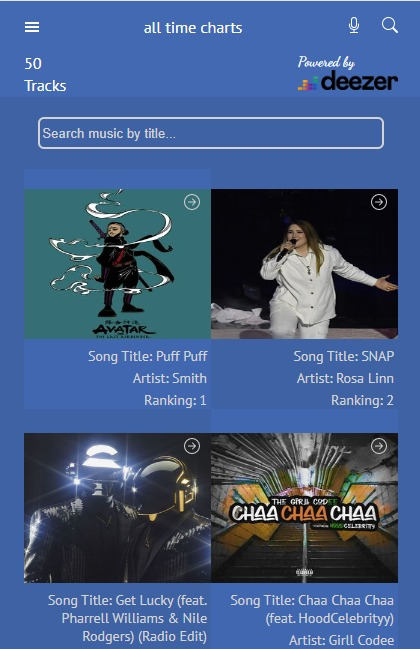
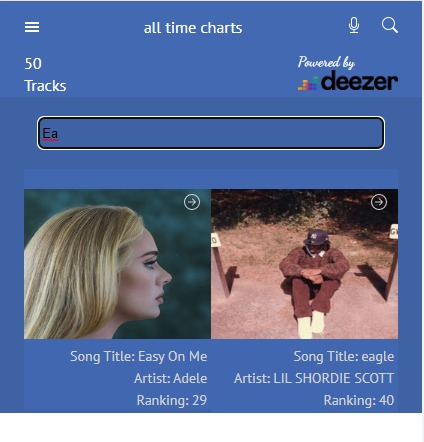

# Deezer Music App

> Project Description.

> "Deezer Music App" is an entertainment app that sort through musical chart to bring all time music hits around the world to your doorstep and the fun part is that it comes with preview to the music if for instance the user cannot decide. It is powered by  

## Built With

- JavaScript
- React
- Redux
- HTML
- CSS
- Webpack
- Git & Github

## Live Demo
Click [here](https://cheerful-crostata-ea300b.netlify.app/) to view live demo

|  Homepage                                                                                                                                                                 |Detail View                                                                                                                                                                 |
| --------------------------------------------------------------------------------------------------------------------------------------------------------------------- | --------------------------------------------------------------------------------------------------------------------------------------------------------------------- |
|  |  |

## Search by title

## Getting Started

**This project is part of a training series to highlight the need for proper documentation, best practices, and writing clean codes with html, css, Javascript,React, and React-redux.**

### Prerequisites

- Have an IDE installed on your computer to be able to view the code locally.
- Have a good working knowledge of Git and Github and well as React.

### Setup

- Open a command line terminal (Git bash preferrably) and navigate to a directory where you would like to save the work folder using cd.
- Clone the repository with git clone https://github.com/wale-prog/deezer-music-app
- To get the curent working tree, git fetch --all, then checkout to "dev" branch.
- Finally, display the content of the ./public/index.html by starting the webpack dev server doing the following:
  - navigate to the root directory with a command line terminal
  - run 'npm start'

### Install

- IDE preferrably VScode
- using command line terminal in the root directory install the following:
  - node modules with npm install 

### Usage

- For any individual who wishes to practice and master webpack usage, basic HTML,CSS and Javascript
- For practice of HTML5, CSS and Javascript technologies.

## Author

👤 **Wale Olapetan**

- GitHub: [@wale-prog](https://github.com/wale-prog)
- Twitter: [@Wale_Petan](https://twitter.com/wale_Petan)
- LinkedIn: [@walepetan](https://www.linkedin.com/in/walepetan/)

## 🤝 Contributing

Contributions, issues, and feature requests are welcome!

## Show your support

Give a ⭐️ if you like this project!

## Acknowledgments
- Shoutout to [Nelson Sakwa on Behance](https://www.behance.net/sakwadesignstudio) for the amazing design templates
- Thumbs up to [Robertson](https://github.com/bobb-Rob) for being supportive.
- Microverse.

## 📝 License

This project is [MIT](./LICENSE) licensed.